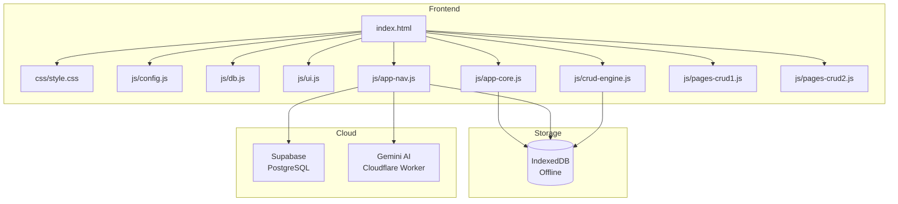
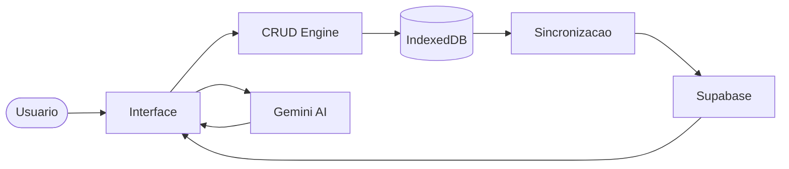
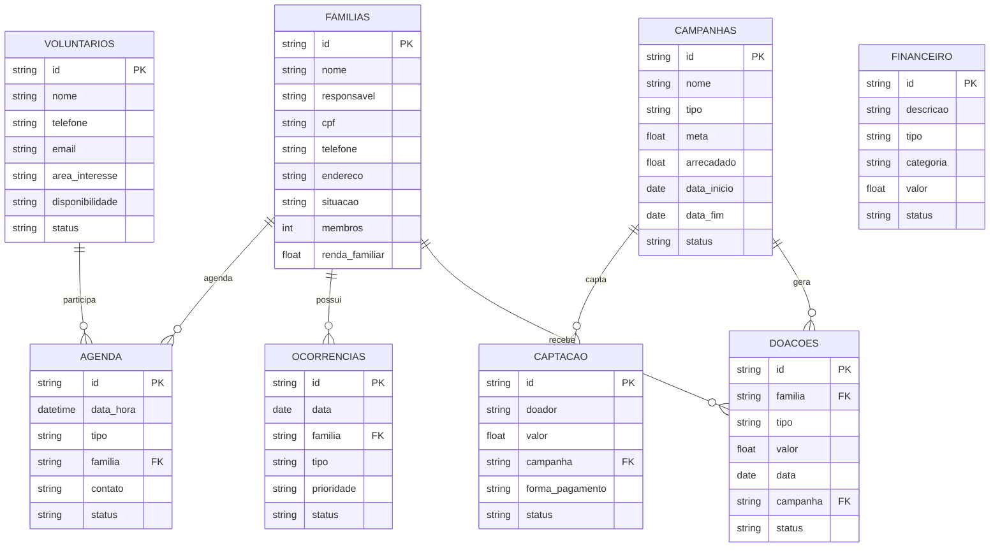

# Conexao Social - CRM para ONGs

Um sistema CRM completo e offline-first para organizações do terceiro setor, adaptado do JAF-CRM (seguros) para gestão de impacto social.

## Tecnologias

| Camada | Tecnologia |
|--------|-----------|
| Frontend | HTML5 + CSS3 + JavaScript (vanilla) |
| Armazenamento Local | IndexedDB (via idb-keyval) |
| Cloud | Supabase (PostgreSQL + Realtime + Auth) |
| IA | Gemini AI (proxy Cloudflare Workers) |
| Exportação | SheetJS (XLSX) |

## Arquitetura



## Fluxo de Dados



## Mapeamento de Entidades

| JAF CRM (Seguros) | Conexao Social (ONG) | Descricao |
|-------------------|---------------------|-----------|
| Clientes | Familias | Familias atendidas pela ONG |
| Apolices | Doacoes | Doacoes recebidas |
| Propostas | Campanhas | Campanhas de arrecadacao |
| Leads | Voluntarios | Voluntarios cadastrados |
| Producao | Captacao | Captacao de recursos |
| Comissoes | Financeiro | Fluxo financeiro |
| Sinistros | Ocorrencias | Ocorrencias sociais |
| - | Agenda | Agenda de atendimentos |

## Modelo de Dados



## Funcionalidades

### Core
- CRUD completo para todas as entidades
- Busca rapida com atalho `Ctrl+K`
- Modo escuro
- Exportacao para Excel (XLSX)
- Visao 360° de familias
- Kanban para voluntarios

### Offline-first
- IndexedDB como armazenamento primario
- Sincronizacao bidirecional com Supabase
- Realtime updates via Supabase Subscription

### IA
- Integracao com Gemini AI para analise de dados
- Sugestoes inteligentes baseadas no contexto

## Como Usar

1. Abra o `index.html` no navegador (Chrome recomendado)
2. Faca login com qualquer email/senha (autenticacao local)
3. Configure as chaves do Supabase e Gemini no modal de Configuracoes (`Ctrl+,` ou menu)
4. Comece cadastrando familias, campanhas e voluntarios

### Atalhos de Teclado

| Atalho | Acao |
|--------|------|
| `Ctrl+K` | Busca rapida |
| `Ctrl+,` | Configuracoes |
| `Esc` | Fechar modal |

## Estrutura de Arquivos

```
crm-ongs/
├── index.html          # Entry point
├── README.md           # Documentacao
├── css/
│   └── style.css       # Estilos com tema ONG
└── js/
    ├── config.js       # Constantes, entidades, enums
    ├── db.js           # Camada IndexedDB
    ├── ui.js           # Helpers de interface
    ├── app-core.js     # Login, logout, dark mode, init
    ├── app-nav.js      # Navegacao, sync, Gemini, busca
    ├── crud-engine.js  # Engine CRUD generico
    ├── pages-crud1.js  # Dashboard, Familias, Doacoes, Campanhas, Voluntarios
    └── pages-crud2.js  # Captacao, Financeiro, Agenda, Ocorrencias, Relatorios, Sync
```

## Licenca

Projeto academico - Trabalho de Faculdade
